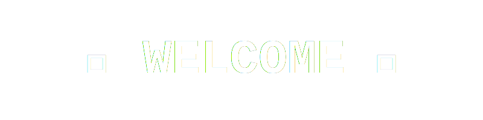

<!-- Banner -->

  

## 👋 Hi there, I'm Atoyi

💡 **About Me**

📚 high school (SMK) student with a strong interest in technology and software development.
💻 Currently learning and exploring various fields including mobile development, programming, and problem-solving.  
🛠 Passionate about improving skills, building projects, and understanding how real-world applications work.
🛠️ Familiar with basic development tools and continuously expanding my knowledge step by step.
🎯 Goal: To grow into a skilled developer and create useful, impactful digital solutions.

---

## 🛠️ Tech Stack

  

---

## 📊 GitHub Stats

  
  

---

## 🌐 Connect with Me

</a>
  
  

